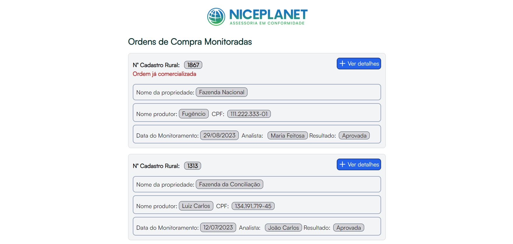

# Teste Front end NicePlanet (Aplicação que exibe ordens de compra monitoradas)

## Capa

 <br/> <br/>

## Funcionalidades da aplicação

- Exibir as ordens de compras monitoradas.
- Sinalizar ordem como comercializada.

## Tecnologias utilizadas

- Vite
- React
- Typescript
- Tailwind CSS
- Axios
- Eslint
- Prettier
- Concurrently
- Phosphor react
- Json-server

## Como executar a aplicação

### Instalação

1. Clone o repositório

```bash
git clone https://github.com/matheusmagnon/TesteFront-End
```

2. Acesse a pasta do projeto

```bash
cd TesteFront-End
```

3. Instale as dependências necessárias

```bash
npm install
```

4. Execute o projeto

```bash
npm run dev
```

- Existe um "back-end" ficticio que é iniciado ao executar esse último comando, os dados ficam no arquivo src/server.json, caso seja necessário alterar as dados deve-se parar a execução da aplicação (Ctrl + C), alterar as informações respeitando a estrutura dos arquivos e executar o comando novamente.
